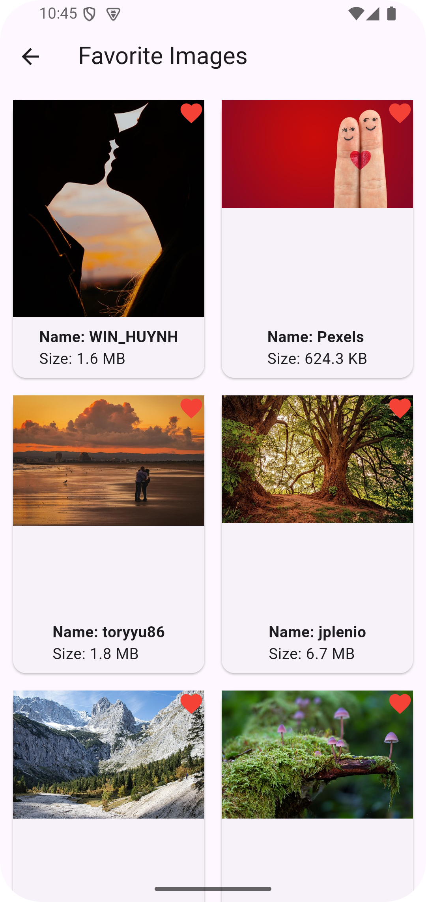

# Pixabay Image Search App

A Flutter application that allows users to search for images from [Pixabay]((https://pixabay.com/api/docs/)) and mark their favorite images. The app features a clean and intuitive UI with two screens: **Search Screen** and **Favorite Screen**.

---

## Features

### 1. **Search Screen**
- **AppBar**: Displays the title "Search Image" and a button to navigate to the Favorite Screen.
- **Search Bar**: Allows users to enter a search query.
- **Search Button**: Triggers the search action to fetch images from the Pixabay API.
- **Grid View**: Displays up to 20 images in a 2-column grid.
  - Each image widget includes:
    - Image preview.
    - Owner name.
    - Image size in a readable format (KB, MB).
  - Tapping an image adds it to the favorites list.
  - Favorited images are visually distinguished (e.g., with a heart icon).

### 2. **Favorite Screen**
- Displays all favorited images in the same grid layout as the Search Screen.
- Tapping an image shows a dialog asking the user if they want to remove it from favorites.

---

## Screenshots

| Search Screen | Favorite Screen |
|---------------|-----------------|
|  |  |

---

## Getting Started

### Prerequisites
- Flutter SDK (version 3.0 or higher)
- Dart (version 2.17 or higher)
- Pixabay API key (register at [Pixabay](https://pixabay.com/api/docs/))

### Installation
1. Clone the repository:
   ```bash
   git clone https://github.com/ravikant-paudel/Pixabay.git
   cd pixabay

2. Install dependencies:
    ```bash
    flutter pub get

3. Run the app:
    ```bash
    flutter run


Project Structure

        lib/
          ├── feature/
          │   ├── favourite/
          │   │   ├── favourite_bloc.dart
          │   │   ├── favourite_screen.dart
          │   ├── search/
          │   │   ├── search_bloc.dart
          │   │   ├── search_page.dart
          │   │   ├── search_repository.dart
          │   │   └── search_service.dart
          │   └── models/
          │       ├── image_model.dart
          │       └── api_response_model.dart
          ├── main.dart
          test/
          ├── 


Testing
The app includes comprehensive unit and widget tests. To run the tests, use the following command:

    flutter test

To generate a coverage report, run:

    flutter test --coverage

## Dependencies

The project uses the following dependencies to ensure smooth functionality and maintainability:

### Main Dependencies
- **[flutter_bloc](https://pub.dev/packages/flutter_bloc)**: For state management using the BLoC pattern.
- **[dio](https://pub.dev/packages/dio)**: A powerful HTTP client for making API requests to Pixabay.
- **[equatable](https://pub.dev/packages/equatable)**: Simplifies equality comparisons for state objects in BLoC.
- **[cached_network_image](https://pub.dev/packages/cached_network_image)**: Efficiently caches and displays network images, improving performance.

### Dev Dependencies
- **[flutter_lints](https://pub.dev/packages/flutter_lints)**: Provides a set of recommended linting rules for Flutter projects.
- **[mocktail](https://pub.dev/packages/mocktail)**: A mocking library for writing unit and widget tests.
- **[bloc_test](https://pub.dev/packages/bloc_test)**: Provides utilities for testing BLoCs.
- **[test](https://pub.dev/packages/test)**: The core testing library for Dart.

---

## Acknowledgments

- **[Pixabay](https://pixabay.com/)**: For providing the free image API.
- **[Flutter](https://flutter.dev/)**: For the amazing framework that made this project possible.

---

## Contact

For any questions or feedback, feel free to reach out:

- **Name**: Ravikant Paudel
- **Email**: developer.paudel@gmail.com
- **GitHub**: [ravikant-paudel](https://github.com/ravikant-paudel)
